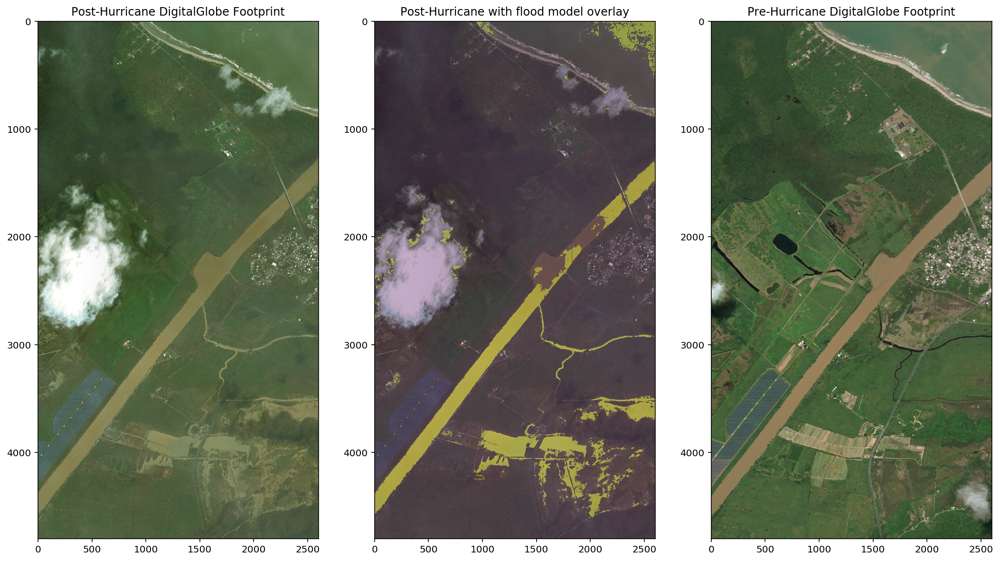

### Here is a test of applying my model in Puerto Rico after Hurricane Maria

While there is massive hurriane damage in Puerto Rico, most of it is not flooding.  Puertro Rico just is much more hilly and has better drainage than Houston.  There isn't a lot of level ground for water to accumulate.  However I did manage to find a little patch east of San Pablo that was in both the before and after imagery, so here it is!

The model seems to work relatively well on this part of the island.  Some areas of very different soil/vegitation colors, so it remains to be seen how well that will be handled; that is without first train on data in this region.
