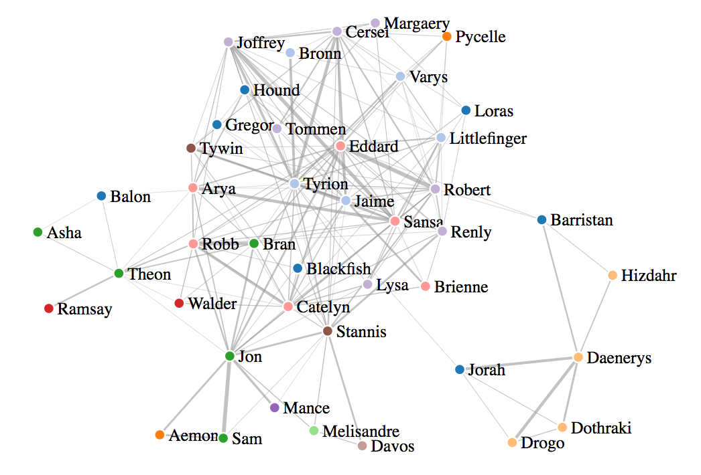
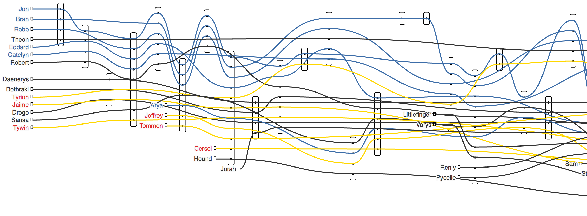
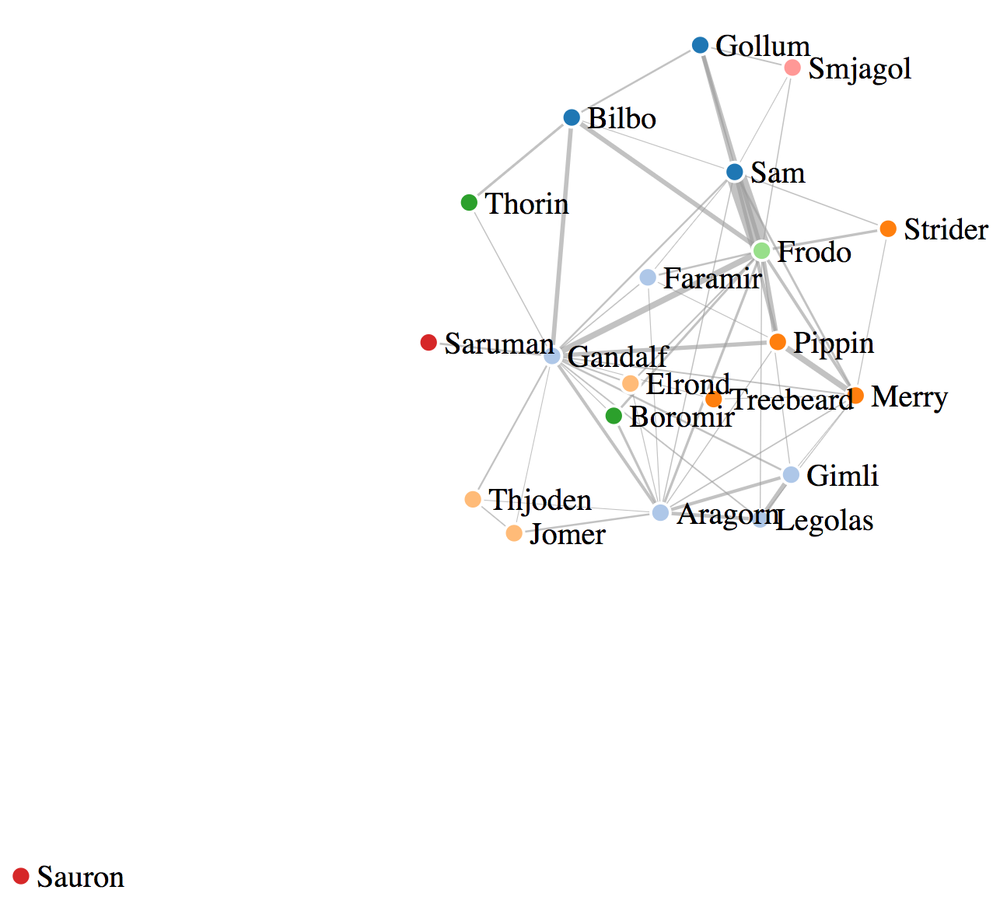
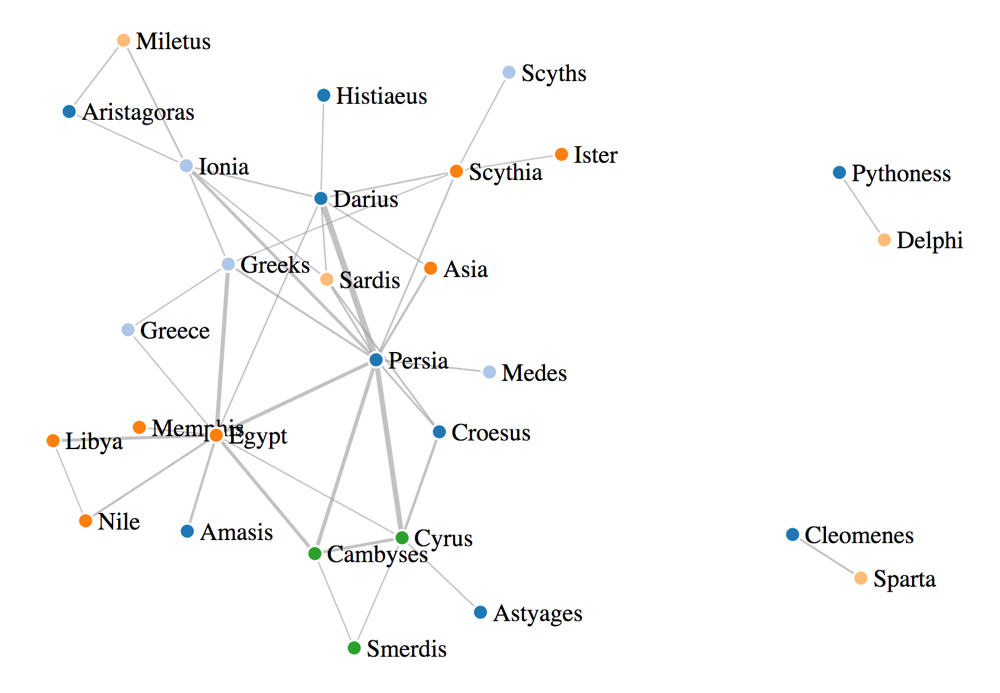

Presented my **Natural Language Processing (NLP)** Project for the Metis folks Friday ([presentation link](https://docs.google.com/presentation/d/e/2PACX-1vQI12pBd5YJu_Un6LCz_z0nfKutBcjuttQeyLiNrsyORLuqkFzbiMVg5jW4Rlhzz8RB-KTBwi-KJXsj/pub?start=false&loop=false&delayms=10000)).  

For this one I wanted to try something quite a bit different than the previous couple of projects, so I decided to dive into the wilds of unsupervised learning, Word2vec, and d3.js visualization.  

### My basic premise is this:

**Build out process to map out the interactions/relationships between main characters in a novel, both over time and by total weight, and visualize these interactions effectively (which gave an excuse to learn a little d3.js).  The pipeline should be largely automated.**

Here is a link the resulting pipeline on github:  [InteractionMaps](https://github.com/Lichtphyz/InteractionMaps)

I spent most of the time working with the Game of Thrones series, but then pushed Lord of the Rings and the writing of the ancient greek Herodotus through it once completed.  The pipeline takes less than an hour, the majority of which is messing with the d3 visualizations, not NLP.  *(exception:  some books have characters going by a lot of different names (Game of Thrones has a TON of these!) making and correcting for these associations could add a couple of extra hours to the pipeline)*

I think the presentation went over a lot better than my last couple, tried to focus more on what I had delivered, why you'd want it, and especially less on how it was made (which, as a teacher, it is a bit painful not sharing much of the process that went into making something!).

### I've added a few preview pictures below, as well as links to my d3.js *interactive* versions on Blockbuilder.org which are a lot more fun to look at!

Game of Thrones (A Song of Ice and Fire, all 5 books):   [Interaction Web](https://bl.ocks.org/Lichtphyz/605c321a7714be62d15e76ff98cd3791/e93fa9b1cdabb71a612b3f113218248c2fcc1795)    &    [Narrative Map](https://bl.ocks.org/Lichtphyz/raw/61c7c92f7ab5d020cd6fb06ce25d1205/5d6fa8020d3ec19850d9d0b5613cab04fe48b189/) . (also, [here is an unfinished d3 confusion matrix](http://bl.ocks.org/Lichtphyz/88ba061011589c805eb016d0f9d61a79/5f9a16cb8f32c8d0af3713fa45e252dff80ea74a), but at the moment there is still a problem with the interactions --> color density mapping)

Lord of the Rings (original trilogy):   [Interaction Web](https://bl.ocks.org/Lichtphyz/559dad1ad39212656b874805a52efd3b/a5a76c44261b5cbbd8d9393f4c0827177d53e524)    &    [Narrative Map](https://bl.ocks.org/Lichtphyz/raw/db53a0180db3b98697bb2b1359dd4373/b0eea6e16a7027bfd407cdbe5dda8572d2815a2a/)

**The Histories of Herodotus Herodotus: 440 B.C.E.** (English Translation) :  [Interaction Web](https://bl.ocks.org/Lichtphyz/1810b3f2fe6bf09a6896c8610a3983da/265858417daee9380dd426c3fce34d4a3c936ac5 

