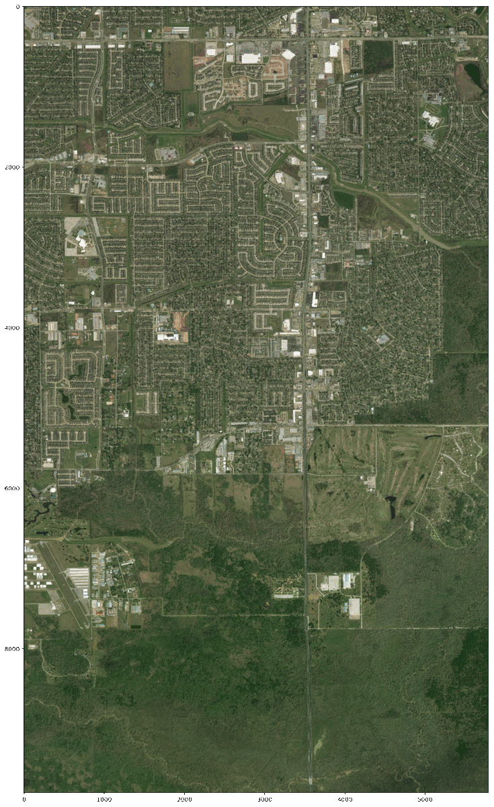

### I have cleaned up the Houston Flooding segmenation project's [GitHub page](https://github.com/Lichtphyz/Houston_flooding) a bit to make everything more presentable.

## Also:

## [Here's a link to a presentation](https://docs.google.com/presentation/d/e/2PACX-1vQL4lvBRuwTnkPMcWgemC2gNoN51SNeYtfwQ4IiaP9jh20XWwRdVU7EMRi4_Et_-0ukVCt8l6Ogbp1K/embed?start=false&loop=false&delayms=5000&slide=id.g35f391192_00) that largely explains the process behind the model
#### (and there are a bunch of 'appendix' slides with extra statistics, pictures, ideas, etc.)

Please go take a look and/or contact if me if you are interested in learning more.  I am always happy to discuss the project, it's limitations, my burning ideas on how to overcome them, or anything else data science/imagery related.

And just for fun, here's another 'bonus' segmenation image:

